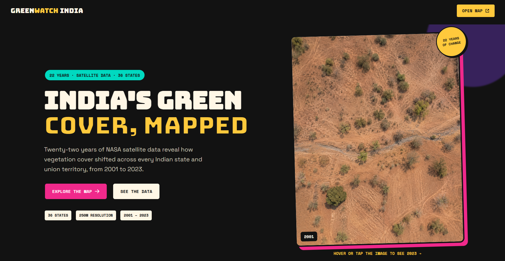

<div align="center">

# 🌿 GREENWATCH INDIA
### India's Green Cover, Mapped - 22 Years of Satellite Data (2001–2023)

**"More data. More color. More clarity."**

[](https://vaibhavnagare-gis.github.io/India_NDVI_Animation/)
[](https://vaibhav-gee-492304.projects.earthengine.app/view/modis-ndvi-animation)
[](LICENSE)

[](https://developer.mozilla.org/en-US/docs/Web/HTML)
[](https://developer.mozilla.org/en-US/docs/Web/CSS)
[](https://developer.mozilla.org/en-US/docs/Web/JavaScript)
[](https://www.chartjs.org/)
[](https://earthengine.google.com/)

</div>

<br>

<div align="center">
  
</div>

<br>

## What This Is

GreenWatch India is a single-page, interactive storytelling atlas that maps **22 years of satellite-observed vegetation cover change** across India's 36 states and union territories, from 2001 to 2023. It combines a Google Earth Engine animation, four interactive chart views, and a plain-English breakdown of what the data actually shows, all in one bold, high-contrast, maximalist design.

No build step. No framework. No backend. Just HTML, CSS, and JavaScript, reading a single CSV.

---

## Features

- **Before/after compare hero** - hover or tap the hero image to flip between a sparse and a dense vegetation view
- **Live Earth Engine animation** - embedded GEE App cycling through six survey years with play, pause, and year-jump controls
- **State Explorer** - pick any of the 36 states and see its five-class vegetation breakdown across every survey year
- **National Trends** - a single line chart of the 22-year national average
- **Top Gainers & Decliners** - sparkline cards for the states that moved the most
- **Sortable State Rankings** - every state, every year, click any column header to re-sort
- **Plain-English chart captions** - a one to two line "Reading it" takeaway under every chart, so the numbers are never left to speak for themselves
- **Fully responsive** - works down to a single-column mobile layout

---

## Tech Stack

| Layer | Tool | Why |
|---|---|---|
| Markup / Styling | HTML5, CSS3 | No build step, fast to deploy anywhere |
| Interactivity | Vanilla JavaScript (ES5) | Zero framework overhead |
| Charts | [Chart.js 4.4.4](https://www.chartjs.org/) | Stacked bar + line charts, loaded via CDN |
| CSV Parsing | [PapaParse 5.4.1](https://www.papaparse.com/) | Client-side CSV parsing, loaded via CDN |
| Satellite Processing | [Google Earth Engine](https://earthengine.google.com/) | Server-side zonal statistics and the embedded animation app |
| Fonts | Bungee, Space Grotesk, Space Mono (Google Fonts) | Bold display type paired with a readable body font |

---

## Data & Methodology

| Field | Value |
|---|---|
| **Dataset** | MODIS/061/MOD44B Vegetation Continuous Fields |
| **Provider** | NASA LP DAAC via Google Earth Engine |
| **Satellite** | Terra |
| **Resolution** | 250 meters |
| **Study Years** | 2001, 2005, 2010, 2015, 2020, 2023 |
| **Coverage** | 36 Indian states and union territories |
| **Derived Variable** | `cover = 100 − Percent_NonVegetated` |
| **Classification** | Very Low (0–20%), Low (20–40%), Moderate (40–60%), High (60–80%), Very High (80–100%) |
| **Statistic** | Area-weighted mean per state, using `ee.Image.pixelArea()` to correct for latitude-dependent pixel size |
| **Quality Masking** | Only valid-range masking (0–100) applied. Quality-band masking was deliberately skipped, since no single documented standard exists for post-hoc QA bit-masking on this product |

All geospatial computation ran server-side in Google Earth Engine. No MODIS rasters or boundary shapefiles are distributed in this repository, only the derived statistical CSV.

### Headline Numbers

| Metric | Value |
|---|---|
| National average, 2001 | 76.9% |
| National average, 2023 | 80.6% |
| Net change | +3.7 percentage points |
| Top gainer | Jharkhand (+10.1) |
| Top decliner | Lakshadweep (−4.6) |

These findings are observational. The dataset shows what changed, not why, so no causal claim is made about policy, climate, or any other driver.

---

## Project Structure

```
India_NDVI_Animation/
├── index.html                          # Single-page markup
├── style.css                           # Full design system
├── script.js                           # All interactivity and chart logic
├── data/
│   └── india_vegcover_state_year.csv   # Zonal statistics, 36 states × 6 years
├── assets/
│   ├── hero-before.png                 # Hero compare image, sparse cover
│   ├── hero-after.png                  # Hero compare image, dense cover
│   └── webpage.png                     # README screenshot
└── README.md
```

---

## Running Locally

No install, no build step.

```bash
git clone https://github.com/VaibhavNagare-GIS/India_NDVI_Animation.git
cd India_NDVI_Animation
python -m http.server 8080
```

Then open `http://localhost:8080` in a browser. Any static file server works equally well (`npx serve`, VS Code's Live Server, etc.), since the CSV is fetched client-side.

---

## Live Links

- **Live site:** [vaibhavnagare-gis.github.io/India_NDVI_Animation](https://vaibhavnagare-gis.github.io/India_NDVI_Animation/)
- **Earth Engine App:** [Open the vegetation cover animation](https://vaibhav-gee-492304.projects.earthengine.app/view/modis-ndvi-animation)

---

## Sources & Citation

DiMiceli, C., et al. (2022). *MODIS/Terra Vegetation Continuous Fields Yearly L3 Global 250m SIN Grid V061* [Data set]. NASA EOSDIS Land Processes Distributed Active Archive Center.
[GEE Catalog page](https://developers.google.com/earth-engine/datasets/catalog/MODIS_061_MOD44B)

State boundary polygons: Survey of India administrative boundary dataset, uploaded as a private Earth Engine asset.

---

## Author

**Vaibhav Shivaji Nagare**
Geospatial Big Data Analysis, Bharati Vidyapeeth Institute of Environment Education and Research, Pune

[](https://www.linkedin.com/in/vaibhav-nagare-gis)
[](https://github.com/VaibhavNagare-GIS)

---

## 📄 License

This project is licensed under the **MIT License**. See the [LICENSE](LICENSE) file for full terms.

[](LICENSE)

<div align="center">

---

**&copy; 2026 GreenWatch India**

</div>
